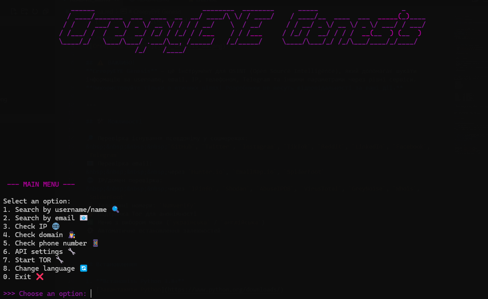

# CreepyEYE Genesis


     
&nbsp;&nbsp;&nbsp;&nbsp;



## ⚠️ ВАЖНО!
**CreepyEYE Genesis** — это инструмент OSINT (Open Source Intelligence), который помогает искать информацию по имени пользователя, email, IP, телефону, Telegram и другим параметрам на различных сервисах.  
**Используйте только в этических целях! Разработчики не несут ответственности за ваши действия.**

⚠️ **Примечание:** CreepyEYE Genesis находится в стадии **Alpha**.  
Не все API полностью протестированы. Используйте с осторожностью.

⚠️ Внимание! Эта русская версия является **community-переводом**.  
Официальные языки: английский и украинский.  
Авторы CreepyEYE не несут ответственности за этот перевод.  
Используйте на свой страх и риск. CreepyEYE предназначен только для **этичного OSINT**.

---

## 🛠️ Возможности

🔎 Проверка существования имени пользователя на платформах соцсетей:  
&nbsp;&nbsp;&nbsp;&nbsp;`GitHub`, `Twitter`, `Instagram`, `TikTok`, `Facebook`, `GitLab`, `Bitbucket`, `Reddit`, `Twitch`, `StackOverflow`, `Kaggle`, `Medium`, `SoundCloud`, `Spotify`

📧 Проверка email:  
&nbsp;&nbsp;&nbsp;&nbsp;через `Hunter.io`, `EmailRep.io`, `SpiderFoot`  
🌐 Проверка IP/доменов:  
&nbsp;&nbsp;&nbsp;&nbsp;через `IPinfo`, `Shodan`, `AbuseIPDB`, `VirusTotal`, `GreyNoise`, `Whois`, `SpiderFoot`  
📱 Телефоны: `Numverify`  
🧅 Поддержка Tor для анонимности  
🈯 Меню выбора языка (`Украинский` / `Английский`)  
⚙️ Автоматическая установка зависимостей

---

## Установка

1. **Установите Python 3.8+**  
   [Скачать Python](https://www.python.org/downloads/)

2. **Установите Git**  
   - Windows: [Скачать Git](https://git-scm.com/downloads/win)  
   - Linux: `sudo apt update && sudo apt install git`  
   - MacOS: [Скачать Git](https://git-scm.com/downloads/mac)

3. **Клонируйте репозиторий**  
   ```sh
   git clone https://github.com/CreepyHunterX/CreepyEYE-Genesis.git
   cd "CreepyEYE-Genesis"
   ```

4. **Установите зависимости**

   ```sh
   pip install -r requirements.txt
   ```

5. **(Опционально) Установите [SpiderFoot](https://github.com/smicallef/spiderfoot)**
   Чтобы использовать функции SpiderFoot, установите его отдельно:

   ```sh
   git clone https://github.com/smicallef/spiderfoot.git
   cd spiderfoot
   pip install -r requirements.txt
   ```

   После установки вернитесь в каталог CreepyEYE Genesis для запуска основной программы.

6. **Запуск программы**

   ```sh
   python ce_genesis.py
   ```

---

## Настройка API ключей

При запуске программы вы сможете создать или открыть файл с API ключами (`settings/api/api_keys.env`).
Вы можете добавлять или изменять ключи в любое время.
Откройте файл и вставьте ваши ключи:

* SHODAN\_API\_KEY
* IPINFO\_TOKEN
* ABUSEIPDB\_KEY
* HUNTER\_API\_KEY
* VIRUSTOTAL\_API\_KEY
* NUMVERIFY\_API\_KEY
* GREYNOISE\_API\_KEY
* EMAILREP\_API\_KEY
* WHOIS\_API\_KEY

### Где взять API ключи и их использование

| Сервис       | Ссылка на API                                              | Назначение                                               |
| ------------ | ---------------------------------------------------------- | -------------------------------------------------------- |
| Shodan       | [https://www.shodan.io/](https://www.shodan.io/)           | Сканирование IP, устройств, открытых портов              |
| IPinfo       | [https://ipinfo.io/](https://ipinfo.io/)                   | Геолокация IP и ASN                                      |
| AbuseIPDB    | [https://www.abuseipdb.com/](https://www.abuseipdb.com/)   | Проверка, не сообщалось ли о вредоносной активности с IP |
| Hunter.io    | [https://hunter.io/](https://hunter.io/)                   | Проверка email и поиск по домену                         |
| Numverify    | [https://numverify.com/](https://numverify.com/)           | Проверка номеров телефонов                               |
| GreyNoise    | [https://api.greynoise.io/](https://api.greynoise.io/)     | Контекст сканеров/ботов                                  |
| EmailRep.io  | [https://emailrep.io/](https://emailrep.io/)               | Репутация email адресов                                  |
| WhoisXML API | [https://whoisxmlapi.com/](https://whoisxmlapi.com/)       | WHOIS данные и информация о доменах                      |
| VirusTotal   | [https://www.virustotal.com/](https://www.virustotal.com/) | Сканирование IP, доменов и файлов на вирусы              |

---

## Использование Tor

Для увеличения анонимности рекомендуется запускать Tor (например, через Tor Browser или tor.exe).
Программа автоматически определяет, работает ли Tor, и использует его для запросов.

---

## Важное уведомление

Инструмент предназначен только для этического OSINT.
Используйте ответственно и в рамках закона.

---

## 🧠 CreepyEYE PRO (План развития)

> 🔥 *CreepyEYE PRO* — это ⚡ **премиум-версия** нашего инструмента OSINT с более чем **30 интегрированными API**,
> позволяющая проводить глубокий поиск, строить связи, хранить сессии в зашифрованном виде и многое другое.
> Идеально подходит для специалистов OSINT, киберразведки и цифровой криминалистики.

---

### 🛠️ Планируемые возможности

* ✅ **Более 30 интегрированных API** (HaveIBeenPwned, Hunter.io, Shodan и др.)
* 🔍 **Глубокий поиск** Telegram, IP, email, username, доменов
* 🧩 **Graph View** — визуализация связанных сущностей
* 💾 **История и сохранение сессий с опцией шифрования**
* 🛡️ **Поддержка TOR / VPN режима**
* 🖥️ **CLI + Web GUI** (Flask / FastAPI)
* 🐳 **Сборки Docker и Windows EXE**
* 🌐 **Автоматический перевод и поддержка нескольких языков**

---

### 📌 Примеры API

| Категория       | API                                 |
| --------------- | ----------------------------------- |
| Username lookup | `GitHub`, `Reddit` и др.            |
| Email check     | `Hunter.io`, `EmailRep` и др.       |
| IP/Domain       | `Shodan`, `IPinfo` и др.            |
| Passwords/leaks | `HaveIBeenPwned`, `LeakCheck` и др. |
| Phones          | `Numverify`, `PhoneInfoga` и др.    |

> ⚠️ Полный список API будет опубликован ближе к релизу.

---

### Доступные переводы / Available translations / Доступні переклади 

[](README_ua.md) [](README.md) 

---