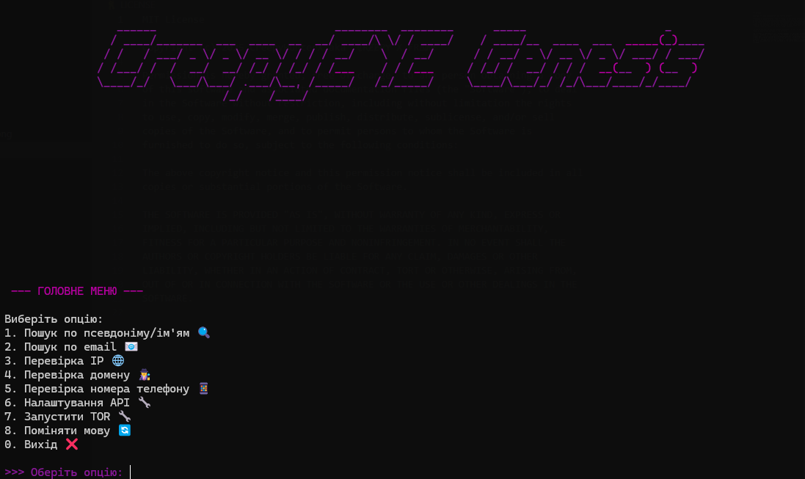

🇺🇸 [English version](README.md)  

# CreepyEYE Genesis
     



## ⚠️ ВАЖЛИВО!
**CreepyEYE Genesis** — це інструмент для OSINT (Open Source Intelligence), який допомагає шукати інформацію за username, email, IP, телефоном, Telegram та іншими параметрами через різні сервіси.  
**Використовуйте тільки в етичних цілях! Розробники не несуть відповідальності за ваші дії.**

⚠️ **Примітка:** CreepyEYE Genesis наразі в **Alpha**.  
Не всі API були повністю протестовані. Використовуйте обережно.

---

## 🛠️ Можливості

🔎 Перевірка існування псевдоніму у соцмережах:  
&nbsp;&nbsp;&nbsp;&nbsp;`GitHub`, `Twitter`, `Instagram`, `TikTok`, `Facebook`, `GitLab`, `Bitbucket`, `Reddit`, `Twitch`, `StackOverflow`, `Kaggle`, `Medium`, `SoundCloud`, `Spotify`

📧 Перевірка email:  
&nbsp;&nbsp;&nbsp;&nbsp;через `Hunter.io`, `EmailRep.io`, `SpiderFoot`  
🌐 IP/домен перевірка:  
&nbsp;&nbsp;&nbsp;&nbsp;через `IPinfo`, `Shodan`, `AbuseIPDB`, `VirusTotal`, `GreyNoise`, `Whois`, `SpiderFoot`  
📱 Телефонні номери: `Numverify`  
🧅 Підтримка Tor для анонімності  
🈯 Меню з вибором мови (`українська` / `англійська`)  
⚙️ Автоматичне встановлення залежностей

---

## Встановлення

1. **Встановіть Python 3.8+**  
   [Завантажити Python](https://www.python.org/downloads/)

2. **Встановіть Git**  
   - Windows: [Завантажити Git](https://git-scm.com/downloads/win)
   - Linux: `sudo apt update && sudo apt install git`
   - MacOS: [Завантажити Git](https://git-scm.com/downloads/mac)

3. **Склонуйте репозиторій**  
   ```sh
   git clone https://github.com/CreepyHunterX/CreepyEYE-Genesis.git
   cd "CreepyEYE-Genesis"
   ```

4. **Встановіть залежності**  
   ```sh
   pip install -r requirements.txt
   ```

5. **(Опційно) Встановіть [SpiderFoot](https://github.com/smicallef/spiderfoot)**  
   Якщо ви хочете використовувати функції SpiderFoot, його потрібно встановити окремо:
   ```sh
   git clone https://github.com/smicallef/spiderfoot.git
   cd spiderfoot
   pip install -r requirements.txt
   ```
   Після встановлення поверніться у директорію CreepyEYE Genesis для запуску основної програми.

6. **Запустіть програму**  
   ```sh
   python ce_genesis.py
   ```

---

## Налаштування API ключів

Під час запуску в програмі буде опція створити або відкрити файл з API ключами (`settings/api/api_keys.env`).  
Ви можете додати або змінити ключі у цьому файлі у будь-який час.
Відкрийте цей файл та вставте свої ключі:

- SHODAN_API_KEY
- IPINFO_TOKEN
- ABUSEIPDB_KEY
- HUNTER_API_KEY
- VIRUSTOTAL_API_KEY
- NUMVERIFY_API_KEY
- GREYNOISE_API_KEY
- EMAILREP_API_KEY
- WHOIS_API_KEY

### Де отримати API ключі та для чого вони потрібні

| Сервіс        | URL для ключа                             | Призначення                                     |
|---------------|-------------------------------------------|------------------------------------------------|
| Shodan        | https://www.shodan.io/                    | Сканування IP, пристроїв, відкритих портів     |
| IPinfo        | https://ipinfo.io/                        | Геолокація IP та інформація про ASN            |
| AbuseIPDB     | https://www.abuseipdb.com/                | Перевірка, чи повідомляли про зловмисну активність IP |
| Hunter.io     | https://hunter.io/                        | Перевірка email та пошук по домену            |
| Numverify     | https://numverify.com/                     | Валідація телефонних номерів                   |
| GreyNoise     | https://api.greynoise.io/                 | Інформація про сканери та ботів в мережі      |
| EmailRep.io   | https://emailrep.io/                       | Перевірка репутації email адрес                |
| WhoisXML API  | https://whoisxmlapi.com/                  | Дані WHOIS та інформація про домени            |
| VirusTotal    | https://www.virustotal.com/               | Перевірка IP, доменів та файлів на шкідливе ПЗ |


---

## Використання Tor

Для підвищення анонімності рекомендується запускати Tor (наприклад, через Tor Browser або tor.exe).  
Програма автоматично визначає, чи працює Tor, і використовує його для запитів.

---

## Важливе попередження

Цей інструмент призначений лише для етичного OSINT.  
Використовуйте його відповідально та тільки в межах закону.

---

## Ліцензія

[MIT License](LICENSE)

---

## 🧠 CreepyEYE PRO (План розробки)

> 🔥 *CreepyEYE PRO* — це ⚡ **вдосконалена версія** нашого OSINT-інструменту з більш ніж **30 інтегрованими API**,  
> що дозволяє робити глибокий пошук, створювати карти зв’язків, зберігати зашифровані сесії та багато іншого.  
> Ідеально для профі OSINT, кіберрозвідки та цифрового слідопитства.

---

### 🛠️ Основні особливості (планується)

- ✅ **Понад 30 інтегрованих API** (HaveIBeenPwned, Hunter.io, Shodan та інші)  
- 🔍 **Глибокий пошук** за Telegram, IP, email, username, доменами  
- 🧩 **Карта зв’язків (Graph View)** — візуалізація пов’язаних об’єктів  
- 💾 **Збереження історії та сесій з опцією шифрування**  
- 🛡️ **Підтримка TOR / VPN-режиму**  
- 🖥️ **CLI + Web GUI** (Flask / FastAPI)  
- 🐳 **Docker-версія та компіляція в EXE для Windows**  
- 🌐 **Автопереклад та багатомовність**

---

### 📌 Приклад API, які будуть доступні

| Категорія        | API                                   |
|------------------|---------------------------------------|
| Username lookup  | `GitHub`, `Reddit` та інші            |
| Email перевірка  | `Hunter.io`, `EmailRep` та інші       |
| IP/Домен         | `Shodan`, `IPinfo` та інші            |
| Паролі / витоки  | `HaveIBeenPwned`, `LeakCheck` та інші |
| Телефони         | `Numverify`, `PhoneInfoga` та інші    |

> ⚠️ Повний список API буде опублікований ближче до релізу.

---
